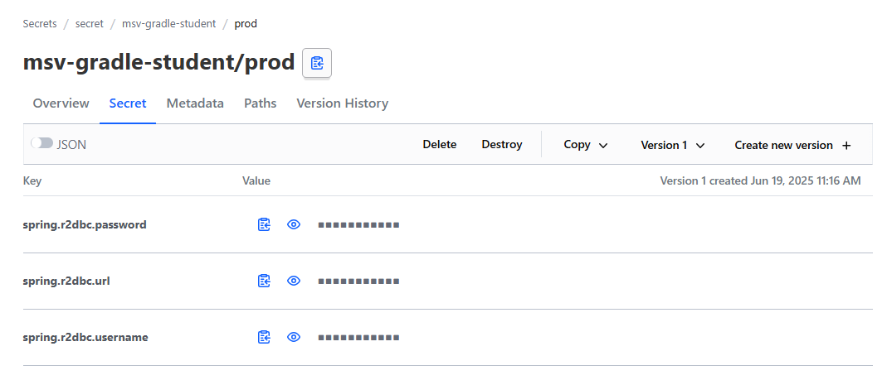

[](https://adoptium.net/es/temurin/releases/?os=windows&arch=any&package=jdk&version=17)

[](https://mvnrepository.com/artifact/org.springframework.boot/spring-boot-starter-web/3.2.5)

[](https://mvnrepository.com/artifact/com.mysql/mysql-connector-j/8.3.0)
[](https://mvnrepository.com/artifact/org.mapstruct/mapstruct/1.5.5.Final)

[](https://mvnrepository.com/artifact/org.projectlombok/lombok/1.18.32)


[](https://developer.hashicorp.com/vault/install)


# API STUDENT

Api creado para registro de estudiantes en MySQL, se ha desarrollado para 2 endpoint:
* Consulta de estudiantes activos.
* Registro de estudiantes.

## Instalación
1. Clonar el repositorio:
   ```bash
   git clone https://github.com/josephmn/msv-maven-student.git

2. Abrir el proyecto en tu IDE favorito (IntelliJ, Eclipse, etc.).
3. Configurar la base de datos MySQL:
    - Crear una base de datos llamada `demo`.
    - Ejecutar el siguiente script SQL para crear la tabla `student`:
      ```sql
      CREATE TABLE student (
         id INT AUTO_INCREMENT PRIMARY KEY,
         document VARCHAR(15),
         name VARCHAR(50),
         last_name VARCHAR(50),
         status BOOLEAN,
         age int
      );
      
      INSERT INTO student (document, name, last_name, status, age)
      VALUES
      ('11111111','Julian','Fernandez',1,25),
      ('22222222','Felipe','Vicente',0,35),
      ('33333333','Alexander','Gutierrez',1,26),
      ('44444444','Felix','Saravia',0,19),
      ('55555555','Alberto','Peña',1,32),
      ('66666666','Cristian','Dominguez',0,35),
      ('77777777','Ronaldo','Flores',1,40),
      ('88888888','Juan','Enrique',0,21);
      ```
4. Instalar Vault para el almacenamiento de secretos:
    - Descargar e instalar Vault para su SO, desde [Vault](https://www.vaultproject.io/downloads).

5. Configurar Vault en windows:
    - Descomprimir el archivo descargado en `C:\vault_1.19.5`:
    - Luego configurar la variable de entorno con el siguiente comando:
      ```bash
      setx VAULT_ADDR "http://localhost:8200"
      ```
    - Para el path de la variable de entorno, se debe colocar la ruta del primer paso:
      
    - Luego abrir una terminal y ejecutar el siguiente comando para iniciar el servidor de Vault:
      ```bash
      vault server --dev --dev-root-token-id="00000000-0000-0000-0000-000000000000"
      ```
    - En la raiz del proyecto, crear un archivo llamado `msv-maven-student.json` y agregar el siguiente contenido:
      ```json
      {
        "spring.r2dbc.url": "r2dbc:mysql://localhost:3306/tu_base_de_datos",
        "spring.r2dbc.username": "tu_username",
        "spring.r2dbc.password": "tu_password"
      }
      ```
      > Reemplazar `tu_base_de_datos`, `tu_username` y `tu_password` con los valores correspondientes a tu base de datos MySQL **antes de copiar y ejecutar en la ventana de cmd**.

    - Luego, en la terminal, ejecutar el siguiente comando para escribir los secretos en Vault:
      ```bash
      vault kv put secret/msv-maven-student/prod @msv-maven-student.json
      ```
6. Ejecutar la aplicación:
    - Asegurarse de que el servidor de Vault esté en ejecución, deberias poder resolver la siguiente URL:
      ```
      http://localhost:8200
      ```
      Ingresar con Method Token y el token `00000000-0000-0000-0000-000000000000`.
      Luego, ingresar a la ruta `secret/msv-maven-student/prod` y en la pestaña **Secret**, al ingresar deberías ver los secretos que se han guardado.
      

    - Ejecutar la aplicación desde tu IDE o usando maven:
      ```bash
      mvn clean install
      mvn spring-boot:run
      ```
7. Probar los endpoints:
   - Para probar los endpoints, puedes usar Postman o cualquier cliente HTTP.
   - Para consultar los estudiantes activos, realiza una solicitud GET a:
     ```cUrl
     curl --location 'http://localhost:8082/api/v1/students'
     ```
   - Para registrar un nuevo estudiante, realiza una solicitud POST a:
     ```cUrl
     curl --location 'http://localhost:8082/api/v1/students' \
     --header 'Content-Type: application/json' \
     --data '{
     "document": "99999999",
     "name": "Enrique",
     "lastName": "Flores",
     "status": true,
     "age": 33
     }'
     ```